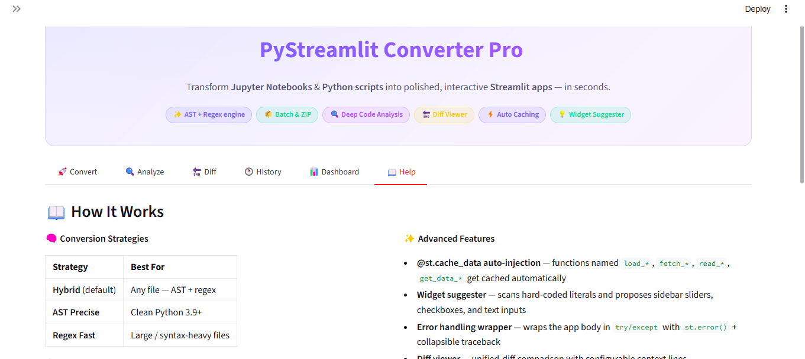
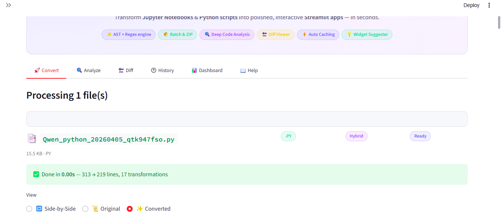
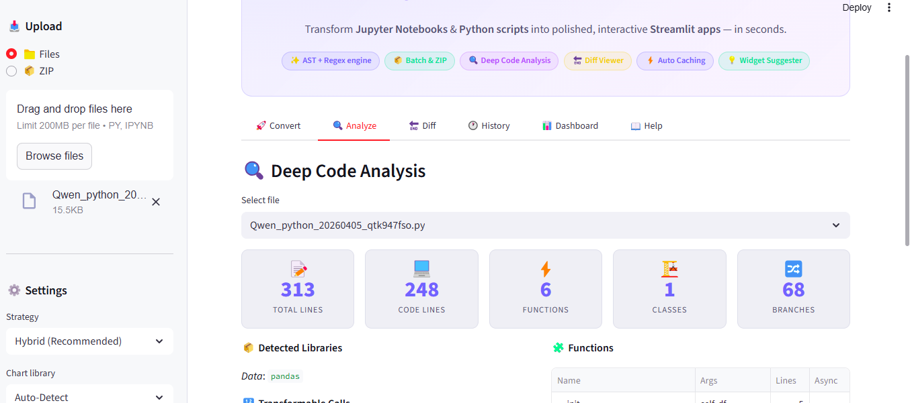

# PyStreamlit Converter Pro

> Transform **Jupyter Notebooks** and **Python scripts** into polished, interactive **Streamlit apps** — in seconds.


---

## ✨ Features

| Feature | Description |
|---|---|
| **Hybrid Conversion Engine** | Three-pass AST + regex pipeline for accurate, reliable conversion |
| **Deep Code Analysis** | Complexity metrics, library detection, function/class inventory |
| **Widget Suggester** | Scans hard-coded literals and proposes sidebar sliders, checkboxes, inputs |
| **Diff Viewer** | Unified-diff comparison with configurable context lines |
| **Auto `@st.cache_data`** | Automatically decorates data-loading functions |
| **Auto Error Handling** | Wraps app body in `try/except` with `st.error()` + traceback expander |
| **Batch ZIP Processing** | Convert an entire folder; download all results as one ZIP |
| **Session History** | Timestamped timeline of all conversions this session |
| **Light / Dark Theme** | Toggle from the sidebar |
| **Two Built-in Samples** | Notebook and script for instant testing |

---

## 🔄 Transformation Map

| Original Python | Streamlit Equivalent |
|---|---|
| `print(x)` | `st.write(x)` |
| `display(df)` | `st.dataframe(df)` |
| `df.head()` | `st.dataframe(df.head())` |
| `df.describe()` | `st.dataframe(df.describe())` |
| `plt.show()` | `st.pyplot(plt.gcf())` |
| `fig.show()` | `st.plotly_chart(fig)` |
| `show(bokeh_fig)` | `st.bokeh_chart(fig)` |
| Notebook markdown cells | `st.markdown(...)` |
| `%magic` / `!shell` commands | *(removed)* |
| `load_*()` / `fetch_*()` functions | `@st.cache_data` applied |

---

## 🚀 Quick Start

### 1. Clone and install

```bash
git clone https://github.com/your-username/pystreamlit-converter.git
cd pystreamlit-converter
pip install -r requirements.txt
```

### 2. Run

```bash
streamlit run app.py
```

### 3. Convert your first file

1. Upload a `.py` or `.ipynb` file via the sidebar
2. Adjust settings (or keep the defaults)
3. Preview the output side-by-side
4. Download the generated `*_streamlit.py`

---

## 🧠 Conversion Strategies

| Strategy | Best For |
|---|---|
| **Hybrid** *(default)* | Any file — AST + regex fallback |
| **AST Precise** | Clean Python 3.9+ with valid syntax |
| **Regex Fast** | Large files or syntax-heavy / magic-heavy code |

---

## 📁 Project Structure

```
pystreamlit-converter/
├── app.py              # Single-file Streamlit application
├── requirements.txt    # Python dependencies
└── README.md           # Documentation
```

---

## ⚙️ Configuration Options

All options are accessible from the sidebar:

| Option | Description | Default |
|---|---|---|
| Strategy | Conversion engine | Hybrid |
| Chart Library | Preferred target chart lib | Auto-Detect |
| App Layout | `wide` or `centered` | `wide` |
| @st.cache_data | Auto-cache data-loading fns | On |
| Error Handling | try/except wrapper | On |
| Auto Sidebar Widgets | Expose literals as controls | On |
| Download Button Stub | CSV export template | On |
| Session State Init | Add session_state init block | Off |
| if __name__ guard | Wrap in main guard | Off |
| Preserve Comments | Keep docstrings / comments | On |
| Large File Threshold | Strategy switch threshold | 200 KB |

---

## 🔍 Analyze Tab

Gives a full breakdown before you convert:

- **Complexity** — total/code/comment/blank lines, cyclomatic complexity
- **Library Detection** — chart, ML, and data libraries
- **Function Inventory** — name, args, line count, async flag
- **Widget Suggestions** — literals that could become interactive controls

---

## 📦 Batch ZIP Processing

Upload a ZIP containing `.py` / `.ipynb` files. The app converts each one and packages all outputs into a downloadable ZIP.

---

## 💡 Tips

1. Run **Analyze** first to understand what will change
2. Enable **Auto Sidebar Widgets** to make parameters interactive
3. Use the **Diff Viewer** to review changes before deploying
4. **Hybrid** mode handles 99% of files reliably

---

## 🗺️ images  of app



#### 🗺️ image 2


#### 🗺️ image 3
"# PYTHON_TO_STREAMLIT_CONVERTOR" 
"# PYTHON_TO_STREAMLIT_CONVERTOR" 
